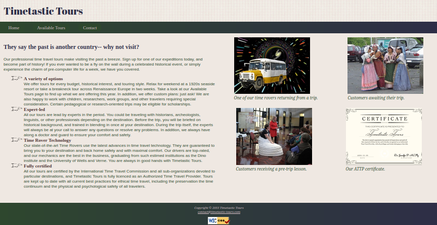

# goose-droid.github.io

This is a simple website with *no JavaScript* used to practice **HTML** and **CSS** skills, created as part of a course at [Davis Tech](https://www.davistech.edu/). Run it as you would any other site, by opening the index.html file with your browser or using live server. 

If you make any additions, please add plenty of comments using regular comment syntax:

**HTML**

``` html
 <!--comment here-->
 ```

**CSS**

``` css
/*comment here*/
```

Please remember to include alt text in any new images. Being able to click the images to view the full size will aso be appreciated.

``` html
<a href="customersbig.jpg">
    
</a>
```

## Pages

* Homepage
* Available Tours
* Contact Page

## Preview


